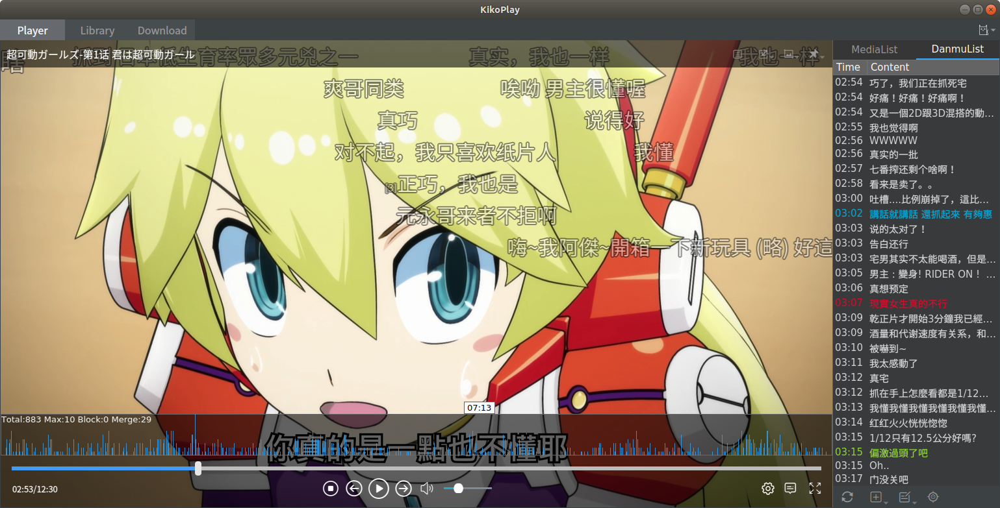
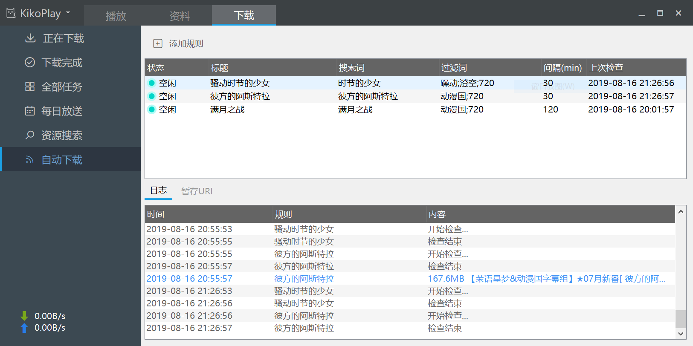

# KikoPlay - A Full-Featured Danmu Player
---
全功能弹幕播放器

## 特性
 - OpenGL渲染，流畅的弹幕体验
 - libmpv播放内核，支持多种媒体文件格式，保留mpv灵活的参数设置
 - 树形播放列表，可随意组织你的番剧
 - 支持所有主流视频网站弹幕搜索下载：AcFun,Bilibili,Tucao,5dm,巴哈姆特,爱奇艺,优酷,腾讯视频,PPTV
 - 灵活的弹幕屏蔽规则设定，支持自动合并相似弹幕、弹幕事件分析标注，提升观看体验
 - 支持批量管理弹幕池，支持弹幕时间轴调整，更好地处理本地视频和网站上的视频时长不一致的情况
 - 资料库可以记录并组织你看过的番剧，同时可以从Bangumi上获取详细信息
 - 局域网服务，你可以通过网页在其他设备上观看，现在还有[Android端](https://github.com/Protostars/KikoPlay-Android-LAN)可供选择
 - 集成aria2下载功能
 - 每日放送功能：可快速浏览新番列表并添加关注
 - 基于Lua脚本的资源搜索功能，你也可以为KikoPlay编写脚本，[脚本仓库](https://github.com/Protostars/KikoPlayScript)
 - 支持自动下载，通过设置规则，KikoPlay可自动搜索下载资源
 - 独特的KikoPlay资源代码和弹幕池代码，可直接分享包含弹幕池信息的资源链接
 - .........

## 编译

KikoPlay基于以下项目：

 - Qt 5.12.3
 - [libmpv](https://github.com/mpv-player/mpv)
 - [aria2](https://github.com/aria2/aria2)
 - [Qt-Nice-Frameless-Window](https://github.com/Bringer-of-Light/Qt-Nice-Frameless-Window)
 - zlib 1.2.11
 - [QHttpEngine](https://github.com/nitroshare/qhttpengine)
 - Lua 5.3

编译环境： MSVC2015，gcc 7.3.0(其他版本未测试)

Windows上使用Qt Creator打开工程文件后可直接编译

Linux上我测试了Ubuntu 18.04 x64，Manjaro 18.0.4 x64，其他系统可自行编译

Ubuntu 18.04 x64上编译的大概流程：

 1. 安装Qt(测试安装的是Qt 5.12.3) 
 2. 安装OpenGL Library:
     ```
     sudo apt-get install build-essential
     sudo apt-get install build-essential libgl1-mesa-dev
     ```
 3. 安装libmpv和zlib:
     ```
     sudo apt-get install libmpv-dev
     sudo apt-get install zlib1g-dev
     ```
 4. 下载编译安装[QHttpEngine](https://github.com/nitroshare/qhttpengine)
 5. 下载Lua 5.3.4编译，得到liblua.a
 6. 准备好KikoPlay.pro文件，现在链接部分是这样的：
     ```
     contains(QT_ARCH, i386){
         win32: LIBS += -L$$PWD/lib/ -llibmpv.dll
         win32: LIBS += -L$$PWD/lib/ -lzlibstat
         win32: LIBS += -L$$PWD/lib/ -lqhttpengine
     }else{
         win32: LIBS += -L$$PWD/lib/x64/ -llibmpv.dll
         win32: LIBS += -L$$PWD/lib/x64/ -lzlibstat
         win32: LIBS += -L$$PWD/lib/x64/ -lqhttpengine
         win32: LIBS += -L$$PWD/lib/x64/ -llua53
         unix{
             LIBS += -L/usr/lib/x86_64-linux-gnu/ -lmpv
             LIBS += -L/usr/lib/x86_64-linux-gnu/ -lz
             LIBS += -L/usr/lib/x86_64-linux-gnu/ -lm
             LIBS += -L$$PWD/lib/x64/linux/ -llua
             LIBS += -L/usr/local/lib/ -lqhttpengine
             LIBS += -L/usr/lib/x86_64-linux-gnu/ -ldl
         }
     }  
     ```
    注意unix部分链接的外部库的路径，默认liblua.a的位置是KikoPlay工程目录下lib/x64/linux目录下，编译好之后可以放到这里
 7. 开始编译，进入KikoPlay工程目录：
     ```
     qmake
     make
     ```

Manjaro上的编译更为简单：
 1. 安装mpv
 2. 下载编译安装[QHttpEngine](https://github.com/nitroshare/qhttpengine)
 3. 开始编译，进入KikoPlay工程目录：
     ```
     qmake
     make
     ```

编译成功后得到KikoPlay文件，可直接运行./KikoPlay，如果提示缺少libqhttpengine等库，可尝试将编译QHttpEngine得到的库放到/usr/lib目录下，也可以将/usr/local/lib加入LD_LIBRARY_PATH环境变量中。下载功能需要aria2c，可自行编译或者下载后放到KikoPlay同一目录下

自从0.2.3版本后只提供64位版本，不建议使用32位版本

## 下载

最新版本均在百度网盘发布（最新版本：0.5.1）
[百度网盘](https://pan.baidu.com/s/1gyT0FU9rioaa77znhAUx2w)

## 反馈

如果有问题，欢迎创建issue或者联系我:
dx_8820832#yeah.net（#→@），或者加QQ群874761809反馈

## 截图







