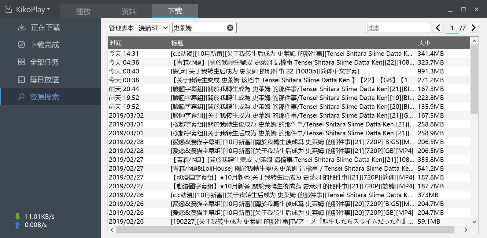

# KikoPlay - A Full-Featured Danmu Player
---
全功能弹幕播放器

## 
 - opengl渲染，流畅的弹幕体验
 - libmpv播放内核，支持多种媒体文件格式，支持mpv灵活的参数设置
 - 树形播放列表，随意组织你的番剧
 - 支持所有主流视频网站弹幕搜索下载：AcFun,Bilibili,Tucao,5dm,巴哈姆特,爱奇艺,优酷,腾讯视频,PPTV
 - 灵活的弹幕屏蔽规则设定，支持自动合并相似弹幕，提升观看体验
 - 支持批量管理弹幕池，支持弹幕时间轴调整，更好地处理本地视频和网站上的视频时长不一致的情况
 - 资料库可以记录并组织你看过的番剧，同时可以从Bangumi上获取详细信息
 - 局域网服务，你可以通过网页在其他设备上观看，现在还有[Android端](https://github.com/Protostars/KikoPlay-Android-LAN)可供选择
 - 集成aria2下载功能
 - 每日放送功能：可快速浏览新番列表并添加关注
 - 基于Lua脚本的资源搜索功能，你也可以为KikoPlay编写脚本，[脚本仓库](https://github.com/Protostars/KikoPlayScript)
 - .........

## 编译

KikoPlay基于以下项目：

 - Qt 5.12.0
 - [libmpv](https://github.com/mpv-player/mpv)
 - [aria2](https://github.com/aria2/aria2)
 - [Qt-Nice-Frameless-Window](https://github.com/Bringer-of-Light/Qt-Nice-Frameless-Window)
 - zlib 1.2.11
 - [QHttpEngine](https://github.com/nitroshare/qhttpengine)
 - Lua 5.3

编译环境： MSVC2015

自从0.2.3版本后只提供64位版本，需要32位版本可自行尝试编译

## 截图

## 下载

最新版本均在百度网盘发布（最新版本：0.5.0）
[百度网盘](https://pan.baidu.com/s/1gyT0FU9rioaa77znhAUx2w)

## 反馈

如果有问题，欢迎创建issue或者联系我:
dx_8820832#yeah.net（#→@），或者加QQ群874761809反馈
