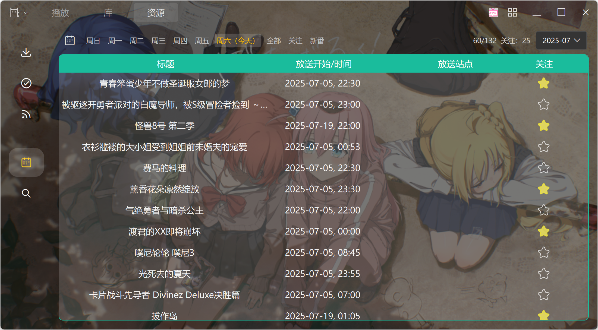

# KikoPlay - NOT ONLY A Full-Featured Danmu Player

---
不仅仅是全功能弹幕播放器

## 特性

 - OpenGL渲染，提供流畅的弹幕体验，同时支持正常滚动模式/直播模式显示弹幕
 - 支持所有主流视频网站弹幕获取，提供灵活的弹幕屏蔽规则设定，还可以自动合并相似弹幕、分析标注弹幕事件，进一步提升观看体验
 - libmpv播放内核，保留mpv灵活的参数设置，支持实时进度条预览
 - 2.0起引入基于whisper.cpp的字幕识别，可以快速识别并翻译字幕(需要设置大模型api key)
 - 强大的树形播放列表，可随意组织视频文件，支持添加WebDAV合集
 - 支持批量管理弹幕池、弹幕时间轴调整，更好地处理本地视频和网站上的视频时长不一致的情况
 - 强大的资料库功能，支持通过多种方式记录并组织你看过的动画，通过脚本扩展可以支持更多信息来源
 - 提供局域网服务功能，你可以通过网页在其他设备上观看，现在还有[Android端](https://github.com/KikoPlayProject/KikoPlay-Android-LAN)可供选择
 - DLNA功能支持投屏到其他设备，也可以作为媒体服务器供其他设备访问
 - 集成每日放送、资源搜索、aria2下载、自动下载等功能，在KikoPlay里即可完成下载、观看、管理等全部操作
 - 1.0起支持lua扩展app，通过扩展app可以为KikoPlay添加更多功能，包括bangumi同步、网页视频下载、m3u8直播等等
 - .........

使用说明可参考[KikoPlay使用说明](docs/KikoPlay使用说明.pdf)  
欢迎大家为KikoPlay编写脚本，[脚本仓库](https://github.com/KikoPlayProject/KikoPlayScript)  
还可以通过KikoPlay的Web API实现其他功能，[Web API参考](web/README.md)  
自1.0.0起增加了扩展App功能，通过扩展App可以为KikoPlay增加更多自定义功能，[App仓库](https://github.com/KikoPlayProject/KikoPlayApp)

## 下载

可以从 [Github](https://github.com/KikoPlayProject/KikoPlay/releases) 或 [百度网盘](https://pan.baidu.com/s/1gyT0FU9rioaa77znhAUx2w) 或 QQ群文件 下载 Windows 版和 Linux 版

Linux 用户也可以通过 [Flathub](https://flathub.org/apps/io.github.KikoPlayProject.KikoPlay) 下载安装使用 KikoPlay

## 编译

KikoPlay 2.0 基于以下项目：
 - Qt 6.6.3
 - [libmpv](https://github.com/mpv-player/mpv)
 - [aria2](https://github.com/aria2/aria2)
 - [ElaWidgetTools](https://github.com/Liniyous/ElaWidgetTools)
 - zlib 1.2.11
 - [QtWebApp](http://stefanfrings.de/qtwebapp/index.html)
 - Lua 5.3
 - [qwebdavlib](https://github.com/mhaller/qwebdavlib)

编译环境： Windows平台使用MSVC2022，其他平台依照平台推荐配置（包管理器/Xcode）

Windows上使用Qt Creator打开build.pro文件后可直接编译，Linux/macOS亦然（依赖要满足要求），当然也可以手动切换到目录执行`qmake`和`make`

Linux各发行版的说明参见[这里](linux.md)

自从0.2.3版本后只提供64位版本，不建议使用32位版本

### cmake编译

关于cmake编译请参见[这里](cmake_build.md) （cmake编译方法为其他网友提供，随着版本更新可能失效，需要用户自行调整）

## 反馈

如果有问题，欢迎创建issue，或者加QQ群874761809反馈

## 赞助

 - [爱发电](https://afdian.com/a/KikoPlay)

## 一起来让KikoPlay更好！

 - 为主程序贡献代码，包括但不限于新功能开发、BUG修复等等
 - 为KikoPlay编写脚本，支持更多弹幕、资料或者资源来源，脚本仓库在[这里](https://github.com/KikoPlayProject/KikoPlayScript)
 - 开发新的扩展App，为KikoPlay增加更多功能，扩展仓库在[这里](https://github.com/KikoPlayProject/KikoPlayApp)
 - 提升局域网网页访问体验，目前的网页是在[这里](https://github.com/KikoPlayProject/KikoPlay/tree/master/web)
 - 改进[Android局域网客户端]((https://github.com/KikoPlayProject/KikoPlay-Android-LAN))
 - 开发其他平台上的局域网客户端
 - 测试，找出BUG并反馈
 - ......
 - Star or Fork

## 截图

