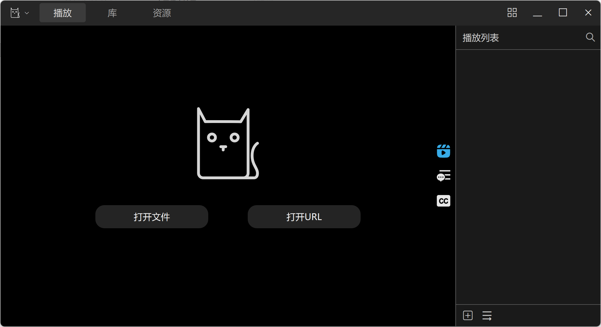
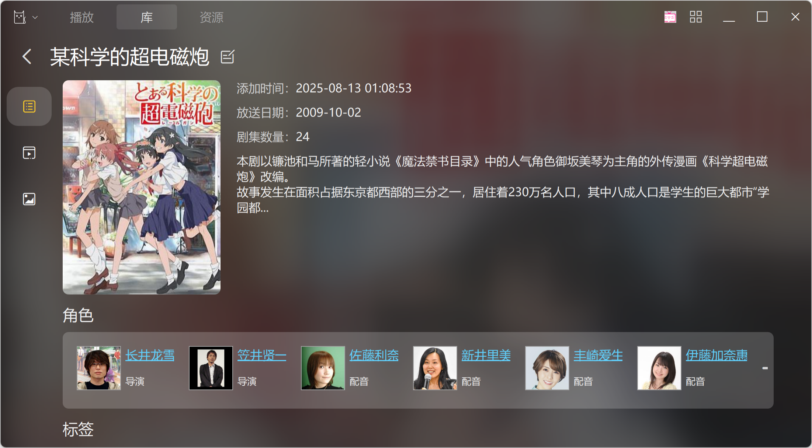

# KikoPlay - NOT ONLY A Full-Featured Danmu Player

---
不仅仅是全功能弹幕播放器

## 特性

 - OpenGL渲染，流畅的弹幕体验
 - libmpv播放内核，保留mpv灵活的参数设置，支持实时进度条预览
 - 树形播放列表，可随意组织视频文件
 - 支持所有主流视频网站弹幕搜索下载，同时可以通过脚本支持更多弹幕来源
 - 灵活的弹幕屏蔽规则设定，支持自动合并相似弹幕、分析标注弹幕事件，提升观看体验
 - 支持批量管理弹幕池、弹幕时间轴调整，更好地处理本地视频和网站上的视频时长不一致的情况
 - 强大的资料库功能，支持通过多种方式记录并组织你看过的动画，通过脚本扩展可以支持更多信息来源
 - 局域网服务，你可以通过网页在其他设备上观看，现在还有[Android端](https://github.com/Protostars/KikoPlay-Android-LAN)可供选择
 - 集成每日放送、资源搜索、aria2下载、自动下载等功能，在KikoPlay里即可完成下载、观看、管理等全部操作
 - .........

任何人都可以为KikoPlay编写脚本来支持更多弹幕、视频资料以及资源来源，[脚本仓库](https://github.com/Protostars/KikoPlayScript)  
还可以通过KikoPlay的Web API实现其他功能，[Web API参考](web/README.md)

## 编译

KikoPlay基于以下项目：

 - Qt 5.15.2
 - [libmpv](https://github.com/mpv-player/mpv)
 - [aria2](https://github.com/aria2/aria2)
 - [Qt-Nice-Frameless-Window](https://github.com/Bringer-of-Light/Qt-Nice-Frameless-Window)
 - zlib 1.2.11
 - [QHttpEngine](https://github.com/nitroshare/qhttpengine)
 - Lua 5.3

编译环境： MSVC2015，gcc 7.3.0(其他版本未测试)

Windows上使用Qt Creator打开工程文件后可直接编译

Linux上看[这里](linux.md)

Mac OS 系统可自行尝试

自从0.2.3版本后只提供64位版本，不建议使用32位版本

## 下载

可以从[Github](https://github.com/Protostars/KikoPlay/releases) 或 [百度网盘](https://pan.baidu.com/s/1gyT0FU9rioaa77znhAUx2w) 或 QQ群文件 下载Windows版

## 反馈

如果有问题，欢迎创建issue或者联系我:
dx_8820832#yeah.net（#→@），或者加QQ群874761809反馈

## 一起来让KikoPlay更好！

 - 为主程序贡献代码，包括但不限于新功能开发、BUG修复等等
 - 为KikoPlay编写脚本，支持更多弹幕、资料或者资源来源，脚本仓库在[这里](https://github.com/Protostars/KikoPlayScript)
 - 提升局域网网页访问体验，目前的网页是在[这里](https://github.com/Protostars/KikoPlay/tree/master/web)
 - 改进[Android局域网客户端]((https://github.com/Protostars/KikoPlay-Android-LAN))
 - 开发其他平台上的局域网客户端
 - 测试，找出BUG并反馈
 - ......
 - Star or Fork

## 截图

